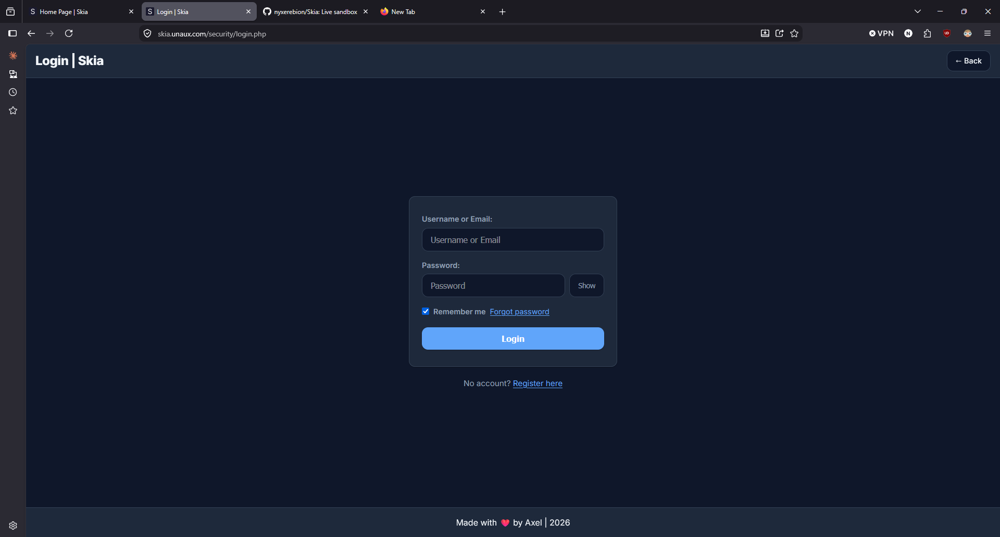
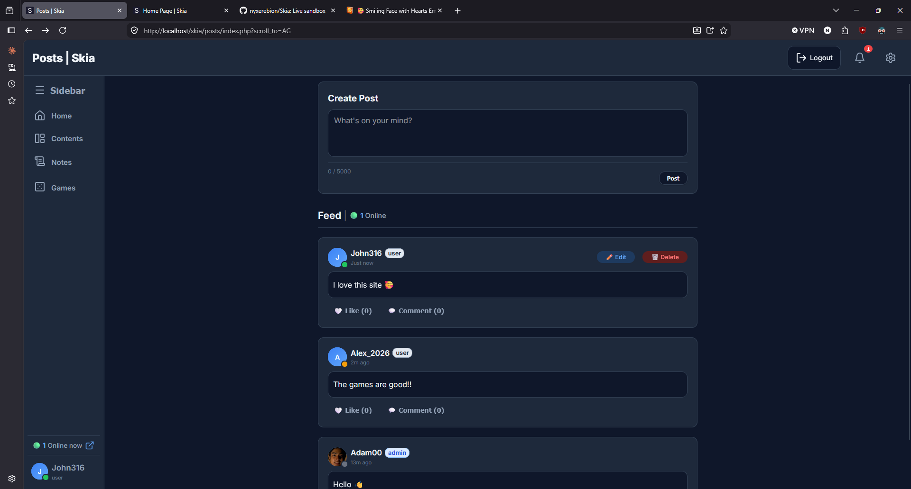
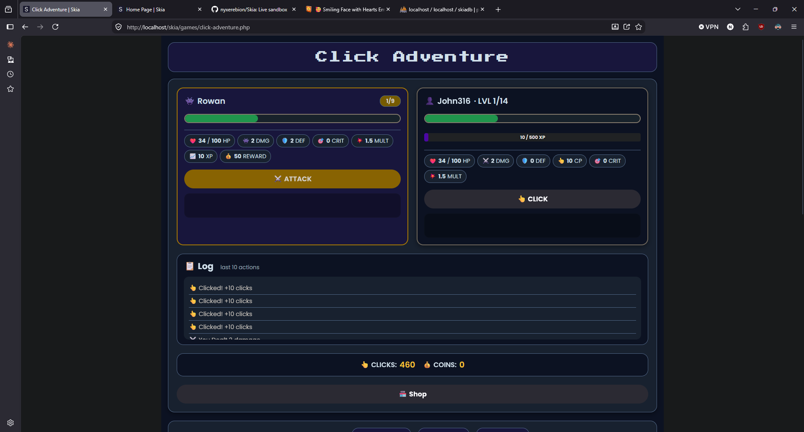
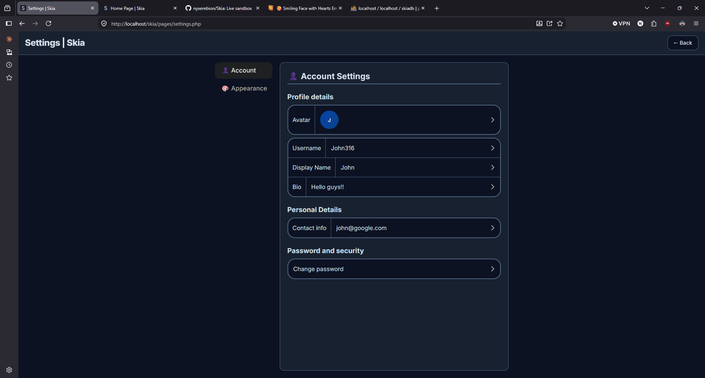

# Skia

**A social platform where you play, post, and connect.**

[](https://php.net)
[](https://mysql.com)
[](https://developer.mozilla.org/en-US/docs/Web/JavaScript)
[](LICENSE)

🔗 **[skia.unaux.com](https://skia.unaux.com)**

---

## What is Skia?

Skia is a full-stack social platform built from scratch — posts, comments, likes, profiles, notifications, and two browser games with progression systems.

Built as a portfolio project to demonstrate full-stack PHP development, security practices, and browser game logic. Contributions and feedback are welcome.

---

## Screenshots

<!-- markdownlint-disable MD033 -->
<p align="center">
  
  
</p>
<p align="center">
  
  
</p>
<!-- markdownlint-enable MD033 -->

---

## Demo Account

Try the live app without registering:

- **URL:** https://skia.unaux.com/security/login.php
- **Username:** `demo`
- **Password:** `demo1234`

The demo account has standard user role. Do not store anything sensitive.

---

## Security

Security was treated as a first-class concern throughout the project.

- Session hardening — `use_strict_mode`, `use_only_cookies`, HttpOnly, SameSite=Lax, regeneration on privilege change
- CSRF tokens on all state-changing requests, including `sendBeacon` calls
- Rate limiting on auth endpoints (login, register, password reset, password verification)
- Prepared statements (PDO) throughout — no string-concatenated queries
- Password hashing via `password_hash()` / `password_verify()`
- Upload validation — extension whitelist, size limit, WebP→JPG conversion
- Output escaping via `htmlspecialchars()` at every render point
- Transactions with `SELECT ... FOR UPDATE` on game state writes
- Enforced Content Security Policy, HSTS on production, `X-Frame-Options`, `X-Content-Type-Options`, `Referrer-Policy`
- Activity logging and audit trails for account changes (name, username, bio, avatar history)
- Unified error responses to prevent account enumeration

---

## Features

### 🎮 Games

- **Click Adventure** — clicker RPG with enemies, shop, leveling, critical hits, defense, vampire healing, XP boosts, and double-level upgrades
- **Whack Gold** — 30-second reflex game with high-score leaderboard

### 💬 Social

- Posts with likes and comments
- Comment likes with notifications
- Follow system with follower counts
- Public user profiles with activity stats
- Avatar upload with client-side crop

### 🔐 Accounts

- Secure login and registration with server-side validation
- Password reset via email (PHPMailer + Mailjet SMTP)
- Username, name, and bio editing with cooldowns (24h name, 48h username)
- Role-based access (user / admin / creator)
- Admin approval workflow for cross-user moderation actions

### 🎨 Interface

- Dark and light themes (localStorage-persisted)
- Responsive layout down to mobile
- Real-time notifications
- Toast messages, modals, and animations
- Live online-user list

---

## Tech Stack

| Layer        | Technology               |
| ------------ | ------------------------ |
| **Backend**  | PHP 8+, MySQL / MariaDB  |
| **Frontend** | Vanilla JS, CSS3         |
| **Email**    | PHPMailer + Mailjet SMTP |
| **Auth**     | Sessions + CSRF tokens   |
| **Packages** | Composer                 |

---

## Project Structure

```text
skia/
├── admin/         → Admin panel
├── creator/       → Creator tools
├── api/           → JSON endpoints
├── backend/       → Config, helpers, email
├── core/          → Bootstrap and head
├── css/           → Stylesheets
├── database/      → Schema and connection
├── games/         → Game pages and logic
├── js/            → Client-side scripts
├── pages/         → Contents, settings, profile
├── posts/         → Post feed
└── security/      → Auth and validation
```

---

## Setup

### Requirements

- PHP 8.1+
- MySQL 5.7+ or MariaDB 10.4+
- Composer
- A web server (Apache, Nginx) or a local stack (Laragon, XAMPP, MAMP)

### Steps

1. Clone the repository:

   ```bash
   git clone https://github.com/nyxerebion/Skia.git
   cd Skia
   ```

2. Install PHP dependencies:

   ```bash
   composer install
   ```

3. Create `.env` in the project root from the template (see below) and fill in real values.

4. Create the database and import the schema:

   ```bash
   mysql -u root -p -e "CREATE DATABASE skiadb"
   mysql -u root -p skiadb < database/schema.sql
   ```

5. Point your web server document root at the project root. For Laragon, place the project at `C:\laragon\www\skia` and visit `http://localhost/skia/guest-page.php`.

6. Visit `/guest-page.php` in the browser.

### Environment Variables

`.env` must exist at the project root. Required keys:

```env
DB_HOST=localhost
DB_NAME=skiadb
DB_USER=root
DB_PASS=

HASHIDS_SALT=replace_with_random_string

SMTP_HOST=in-v3.mailjet.com
SMTP_PORT=587
SMTP_USERNAME=
SMTP_PASSWORD=
SMTP_FROM=you@example.com
SMTP_NAME=Skia
```

`HASHIDS_SALT` must be a non-empty random string. Without it, encoded IDs are predictable.

---

## Notable Engineering Decisions

- **Hashids for public IDs** — user and post IDs are encoded before being sent to the client, so URLs do not expose sequential database IDs. `encodeID()` / `decodeID()` in `security/functions.php`.
- **`SELECT ... FOR UPDATE` on game state** — concurrent attacks in two tabs would otherwise lose damage updates. `api/games/click-attack.php` wraps the read-modify-write in a transaction and locks the player row.
- **Archive over delete** — posts and notes are marked `archived = 1` rather than deleted, with `archived_at` and `archived_by` recorded for audit. Only creator actions trigger permanent deletion.
- **Role as enum, not a table** — the three roles (`user`, `admin`, `creator`) are fixed by design. A lookup table would add joins for no flexibility gain.
- **Admin approval workflow** — admins cannot edit or delete another user's content directly. Actions are queued in `pending_actions` and approved or rejected by a creator.

---

## Roadmap

- [x] Posts, comments, likes
- [x] Click Adventure + Whack Gold
- [x] Password reset via email
- [x] Account settings with cooldowns
- [x] Enforced CSP and HSTS
- [ ] Email verification
- [ ] Email change with verification
- [ ] User achievements
- [ ] Automated tests (PHPUnit)
- [ ] Database migrations

---

## Known Limitations

- No automated tests
- No database migrations — schema changes are applied manually
- CSP does not enforce a nonce-based script policy. Inline event handlers are used throughout.
- Single-server design; no queue, cache layer, or horizontal scaling
- HTML layout is duplicated across pages rather than extracted into a shared include

---

## Contributing

This is a personal portfolio project. Suggestions, bug reports, and pull requests are welcome — open an issue first for anything substantial.

---

## License

MIT — free to use, modify, and learn from. See [LICENSE](LICENSE).

---

**Built by [Axel](https://github.com/nyxerebion) · 2025–2026**
